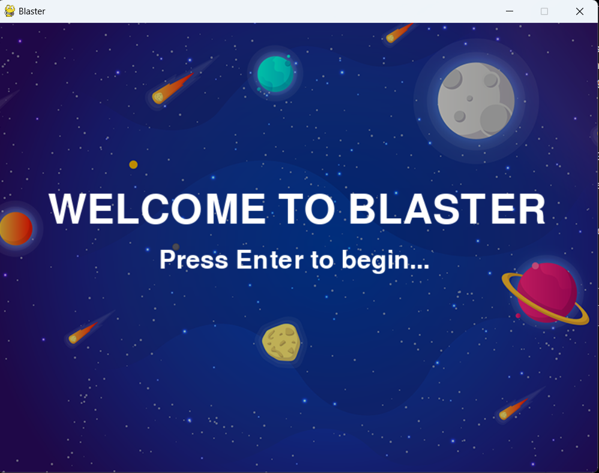
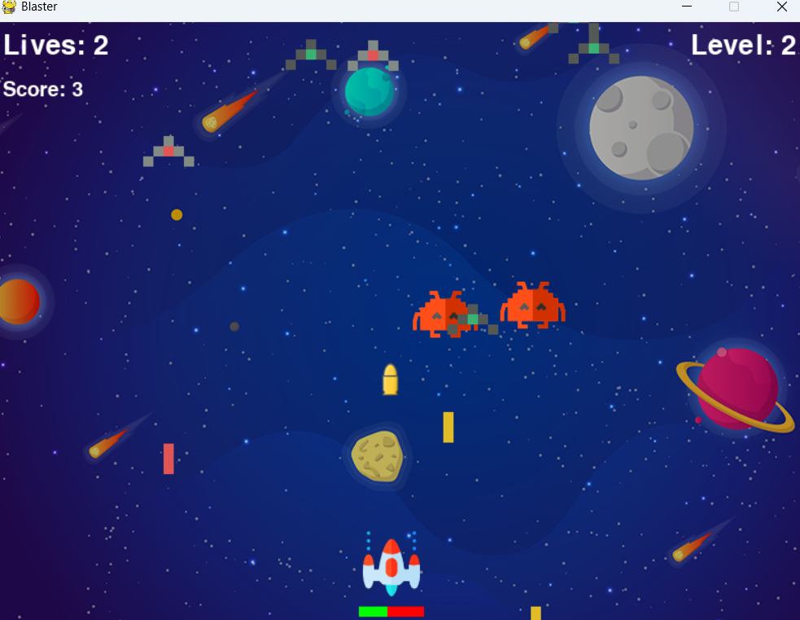
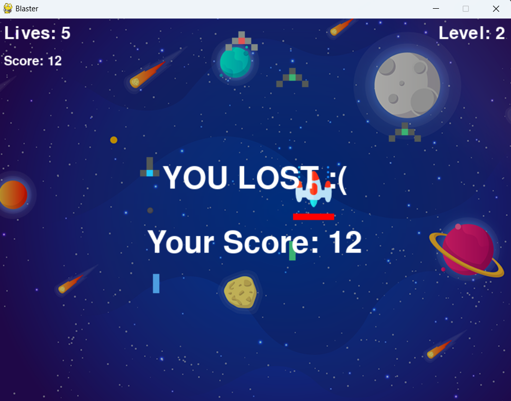

**Blaster - Space Shooter Game**

**Description:**
Blaster is a classic space shooter game built using the Pygame library in Python. Players control a spaceship and battle against waves of enemy ships, aiming to survive as long as possible while accumulating points by shooting down enemies.

**Features:**
- Player-controlled spaceship with movement controls (arrow keys) and shooting capabilities (spacebar).
- Enemies spawn in waves, becoming progressively more challenging as the game progresses.
- Health and score tracking for the player, displayed on the game screen.
- Immersive background music and sound effects for laser shots and enemy collisions.
- Main menu interface allowing players to start the game by pressing the Enter key.

**Instructions:**
1. Launch the game by running the Python script.
2. Use the arrow keys to control the player's spaceship: left, right, up, and down for movement.
3. Press the spacebar to shoot lasers and destroy enemy ships.
4. Survive for as long as possible, accumulating points by defeating enemies and avoiding collisions.
5. Monitor your health and score displayed on the game screen.
6. Enjoy immersive background music and sound effects throughout the gameplay experience.

**Screenshots:**






**Credits:**
This game was developed by Pritam Chakraborty. Feel free to contribute or provide feedback.

**License:**
This project is licensed under the [MIT License](LICENSE).

**Requirements:**
- Python 3.x
- Pygame library

**Installation:**
1. Clone the repository or download the source code files.
2. Install Pygame library using pip:
   ```
   pip install pygame
   ```

**Usage:**
1. Navigate to the directory containing the game files.
2. Run the Python script:
   ```
   python blaster_game.py
   ```

**Controls:**
- Arrow keys: Move the player's spaceship.
- Spacebar: Shoot lasers.

**Enjoy the game and happy blasting!**